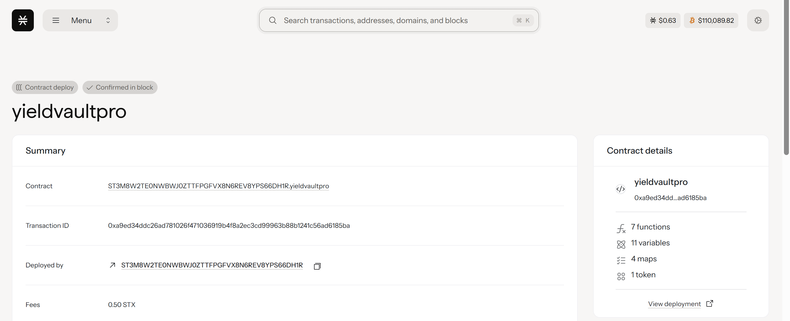

# YieldVault Pro

## Project Description

YieldVault Pro is an automated yield optimization protocol built on the Stacks blockchain that maximizes returns by continuously rebalancing funds across multiple DeFi protocols. The protocol automatically allocates user deposits to the highest-yielding opportunities while maintaining diversification and risk management.

Key features:
- **Automated Yield Optimization**: Continuously monitors and rebalances across multiple DeFi protocols (ALEX, Arkadiko, StackSwap)
- **Tokenized Shares**: Users receive vault shares (fungible tokens) representing their proportional ownership
- **Dynamic Allocation**: Smart allocation algorithm that places 70% of funds in the highest-yielding protocol and 15% each in the remaining protocols
- **Real-time APY Tracking**: Monitors current APY rates across supported protocols
- **Minimum Deposit Protection**: Ensures meaningful participation with 100 STX minimum deposit
- **Transparent Operations**: All rebalancing and optimization events are logged on-chain

## Project Vision

To democratize access to sophisticated yield farming strategies by creating an automated, transparent, and efficient protocol that maximizes returns for all users regardless of their DeFi expertise or capital size. YieldVault Pro aims to become the premier yield optimization solution on the Stacks ecosystem, providing institutional-grade portfolio management to retail users.

Our vision includes:
- **Accessibility**: Making advanced DeFi strategies available to everyone
- **Automation**: Removing the complexity of manual yield farming
- **Transparency**: All operations and decisions are verifiable on-chain
- **Security**: Prioritizing fund safety through diversification and risk management
- **Innovation**: Continuously integrating new protocols and optimization strategies

## Future Scope

### Phase 1: Core Infrastructure (Current)
- [x] Basic deposit and share minting functionality
- [x] Automated yield optimization across 3 major protocols
- [x] Real-time protocol monitoring and rebalancing
- [x] Tokenized vault shares system

### Phase 2: Advanced Features (Q2 2025)
- [ ] **Multi-Asset Support**: Extend beyond STX to support other Stacks-native tokens
- [ ] **Advanced Risk Management**: Implement volatility-based allocation adjustments
- [ ] **Governance Token**: Launch YIELD token for protocol governance and fee sharing
- [ ] **Yield Compounding**: Automatic reinvestment of earned yields
- [ ] **Emergency Withdrawal**: Quick exit mechanism during market stress

### Phase 3: Ecosystem Expansion (Q3-Q4 2025)
- [ ] **Cross-Chain Integration**: Bridge to other Bitcoin L2s and sidechains
- [ ] **Institutional Features**: Large-scale deposit handling and custom strategies
- [ ] **Insurance Integration**: Partner with DeFi insurance protocols
- [ ] **Mobile App**: User-friendly mobile interface for portfolio management
- [ ] **Analytics Dashboard**: Advanced yield tracking and performance analytics

### Phase 4: DeFi Innovation (2026)
- [ ] **AI-Powered Optimization**: Machine learning algorithms for yield prediction
- [ ] **Flash Loan Integration**: Leverage flash loans for rebalancing efficiency
- [ ] **Liquid Staking**: Integration with Stacks liquid staking protocols
- [ ] **Options Strategies**: Covered call and protective put strategies
- [ ] **Zap Functions**: Single-transaction deposit/withdrawal with automatic swapping

### Long-term Vision
- **Become the central yield hub** for the Stacks DeFi ecosystem
- **Process over $100M TVL** across multiple asset classes
- **Support 20+ DeFi protocols** with advanced allocation strategies
- **Achieve institutional adoption** with enterprise-grade features
- **Pioneer Bitcoin DeFi** yield optimization standards

## Technical Roadmap
- **Smart Contract Upgrades**: Implement proxy patterns for seamless upgrades
- **Oracle Integration**: Chainlink-style price feeds for accurate valuation
- **MEV Protection**: Implement MEV-resistant rebalancing mechanisms
- **Gas Optimization**: Reduce transaction costs through batch operations
- **Audits & Security**: Regular security audits and bug bounty programs

## Contract Address Details

Contract ID:ST3M8W2TE0NWBWJ0ZTTFPGFVX8N6REV8YPS66DH1R.yieldvaultpro

---

## Quick Start

### For Users
1. **Connect Wallet**: Use Leather, Xverse, or compatible Stacks wallet
2. **Deposit STX**: Minimum 100 STX required
3. **Receive Shares**: Get vault shares representing your ownership
4. **Earn Yield**: Sit back as the protocol optimizes your returns

### For Developers
1. **Clone Repository**: `git clone [repository-url]`
2. **Install Clarinet**: Follow Stacks development setup
3. **Test Locally**: `clarinet test`
4. **Deploy**: Use provided deployment scripts

### Contract Interactions
- **deposit-and-mint-shares**: Deposit STX and receive vault shares
- **optimize-yield-allocation**: Trigger yield optimization (owner/automated)
- **get-vault-info**: Query current vault status
- **get-user-position**: Check your vault position

## Security & Audits
- Smart contract security audits: `[PLANNED]`
- Bug bounty program: `[PLANNED]`
- Multi-sig governance: `[PLANNED]`

---

